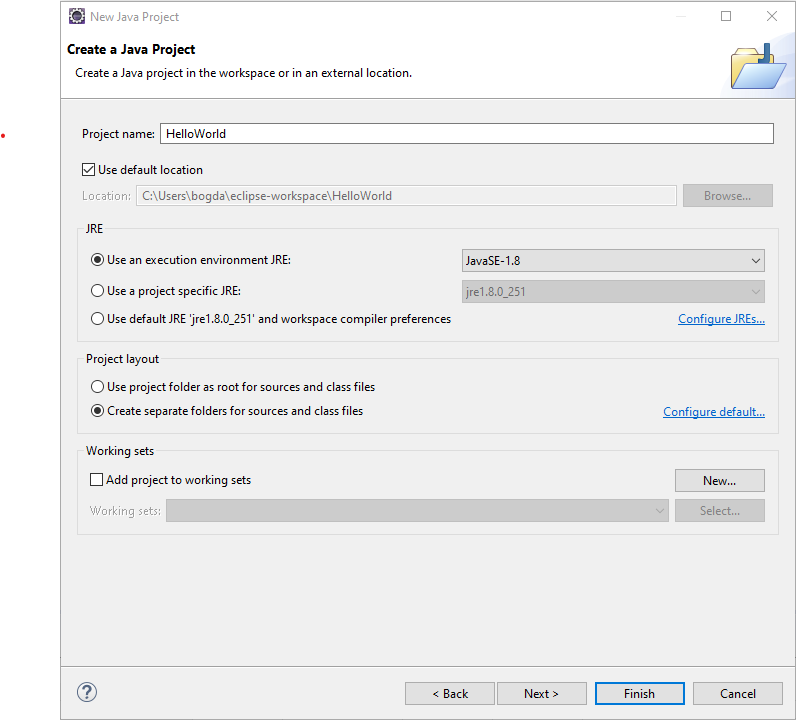

# Introduction to Java Programming

## Objectives
- Introduction to computers
- What is a programming language?
- Short introduction to Java
- Environment setup
- Create your first Java program
- Homework exercises

## 1. Introduction to computers
- Before we learn about Java, we should have a very brief introduction to how computers are supposed to work.
- A computer is not smarter than us, it is only faster and less error prone because it does not get tired.
- Behind the scene, all the computers work by using the binary system
- A binary system is the system which makes use of only two digits: `0` and `1` and:
    - `0` means does not have voltage
    - `1` mean it has voltage
- It might be confusing at first, how does the computer works only with `1` and `0` when we can also type other digits?
    - The answer is that every number can be converted to binary (also called base 2)
    - For example, let's suppose we have the number 237 and we want it to be converte in binary. In order to do this,we have to divide by 2 until we get 0 and at each step we have to keep the remainder. In the end, all that we have to do is to read the remainder backwards.
    - Below you have all the steps detailed of how can we convert 237 from base 10 in base 2:
        - Divide the number by 2 and keep the `remainder` ( 237 / 2 = 118 and remainder `1`)
        - Now divide the previous result, 118 by 2 and also keep the remainder ( 118/2 = 59 and remainder is `0`)
        - Divide 59 by 2 and keep the remainder  ( 59 / 2 = 29 and remainder `1`)
        - Divide 29 by 2 and keep the remainder ( 29 / 2 = 14 and remainder is `1`)
        - Divide 14 by 2 and keep the remainder ( 14 / 2 = 7 and remainder is `0`)
        - Divide 7 by 2 and keep the remainder ( 7 / 2 = 3 and remainder is `1`)
        - Divide 3 by 2 and keep the remainder ( 3 / 2 = 1 and remainder `1`)
        - Divide 1 by 2 and keep the remainder (1 / 2 = 0 and remainder `1`)
        - Now the conversion is complete and the remainders are 1,0,1,1,0,1,1,1 thus in order to find the binary equivalent of number 237 we have to reverse the remainders, obtaining `11101101`

- Now that we know how to convert from base 10 in base 2, we should imagine that we will also have to convert from base 2 in base 10.
- This operation is very simple, we only have to play with powers of 2
- Let's suppose we want to convert our previous result (`11101101`) just to check that we can obtain back the `237` number
- In order to do this, we start from the last digit of the number, and multiply each digit with a power of 2. The power of 2 will start from 0 and then will increase as long as we move to the left. Let's see below each step:
    - First we take the last digit (`1`) and multiply it with 2 to the power 0 (`1 * 2^0 = 1 * 1 = 1`)
    - Next we multiply `0` with 2 to the power 1 (`0 * 2^1 = 0 * 2 = 0`)
    - Next we multiply `1` with 2 to the power 2 (`1 * 2^2 = 1 * 4 = 4`)
    - Next we multiply `1` with 2 to the power 3 (`1 * 2^3 = 1 * 8 = 8`)
    - Next we multiply `0` with 2 to the power 4 (`0 * 2^4 = 0 * 16 = 0`)
    - Next we multiply `1` with 2 to the power 5 (`1 * 2^5 = 1 * 32 = 32`)
    - Next we multiply `1` with 2 to the power 6 (`1 * 2^6 = 1 * 64 = 64`)
    - Next we multiply `1` with 2 to the power 7 (`1 * 2^7 = 1 * 128 = 128`)
    - Now we have to add all the results and obtain the final number: `1 + 0 + 4 + 8 + 0 + 32 + 64 + 128 = 237`


## 2. What is a programming language
- As we saw, a computer only understands `1`s and `0`s. But we can pass to it whatever we want as long as it is in binary format.
- But doing everything in this manner is very difficult as it takes a lot of work to make the conversion, even if we habe like a small program which computes the sum of two numbers.
- We can think to this language (binary language) that the system knows as a low level language.
- In order to ease our development, there was a need for creating high level languages which allow us to avoid this conversion by providing a language syntax very close to the human language. All the conversion, from high level language to the low level language is done behind the scene by a tool called `compiler`

## 3. Short introduction to Java
- Java is a high level programming language
- We can write the code, using a syntax close to the english one in a file which has the extension `.java`
- As the english language, the Java language also has some rules and will enforce us to follow them. For example we are not allowed to use certain keywords in scenarios other than how they were supposed to be used (we can think that similarly, in english, double negation is not allowed)
- After we have written our code in the `.java` file, a tool called compiler will first inspect our code to see if we have broken any rules. If we did, then it will display the rule that we broke with some instructions that will help us to solve it
- After everything is ok with our syntax, the compiler will translate our code in an intermediary language (not the low level language) which is called `bytecode` and will put this translation into a separate file that has a similar name with our previous file only that now it has the extension `.class`
- After we have this `.class` file, the magic of Java comes into play. When it was first released, Java had the slogan of `write once, run everywhere`. This means that we can write a program using Java and it will run the same in all modern operating systems (Windows, Mac OS, Linux, Android, etc). This is possible because there is a tool, called `JVM` or the Java Virtual Machine which will take our bytecode and it will translate it to the language spoken by each operating system.
- We can summarize the steps that our code will pass through before actual running on a specific computer as follows:
    - Write code in .Java file -> Compile the Java file -> Generate the .class file -> Pass the .class file to the JVM -> JVM runs the bytecode from the .class file according to the system where it is installed
- Of course, doing the steps of compiling the code and then taking all the .class files by hand is a cumbersome task, for this we have specialized tools that will do it for us, and this will allows us to focus only on what we aim to create.
- These tools are called IDEs (Integrated Development Environment) and in this course we will be using Eclipse IDE

## 4. Environment setup
- Download Java 8 JDK. This can be done from Oracle's site or by accessing this url https://1drv.ms/u/s!Aq-MvbTMLFIZhuwA0z8TwFucPyQp6g?e=mLypzP which points to my onedrive. This is to avoid the burden of creating an Oracle account
- Download Eclipse IDE from here: https://www.eclipse.org/downloads/
- When installing Eclipse select `Eclipse IDE for Enterprise Java Developers`
- Select all the defaults and press Install and also accept the license (after you have read it, of course). Wait for this to end without opening any other application
- Now you can launch Eclipse
- It is strongly indicated to do these steps together with your instructor

## 5. Create your first Java program
- Launch Eclipse by pressing the Windows button and searching for Eclipse
- Select the workspace that you want to use. An Eclipse workspace can be seen like a storage space. You can think for example that for personal projects you have an workspace and for work projects a different one. This concept of an workspace is just for organizing our projects
- When opening Eclipse for the first time, a welcome page might appear. You can close it by selecting the x button close to the tab. See the image below

- Go to File->New->Project->Java-Java Project
    
- Press Next
- Give a name for your project (e.g HelloWorld). Note that it is best to avoid spaces when naming the project
- After completing the steps from above, everything should look like in the image below:
 
- Press finish
- Select the default perspective and check the box which will persist this setting. A perspective in Eclipse is only a view. And the fact of having multiple perspective is because you can think that in specific scenarios you are only interested in seeing only certain tools.
- In the left hand side you will see the project and if you will expand it you can see that it contains an empty `src` folder. This will be the folder which will contain your code.
-  Right click the src folder => new => class and type the name Application. 
- Check the box which says `public static void main(String[] args)` (it should look like in the image below)
 
- Press finish
- A new tab will be opened inside the Eclipse IDE
- Below the line which says: 
    ```JAVA
		// TODO Auto-generated method stub
    ```
    add the following line: 
    ```JAVA
    System.out.println("Hello, World!");
    ```
- Should look like in the image below:
 
- Run the application by selecting the green arrow from the top bar or by pressing the shortcut `CTRL+F11` or by going to Run menu and selecting Run
- It should display the `Hello, World` text in the console, that is displayed in the bottom side of the editor. See the image below
 

## 6. Homework exercises:
1. Convert from decimal (base 10) to binary (base 2) the following numbers:
    - 29, 33, 19, 89, 55, 458
2. Convert from binary to decimal the following numbers:
    - 101110, 101001, 11101, 111000, 1000100
3. Create another project called `MySecondProjectInJava` which will contain a class together with the logic for displaying the following text: `JAVA is the best programming language`