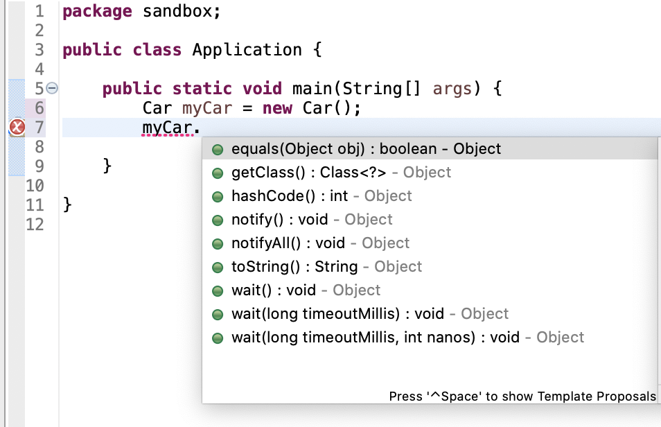
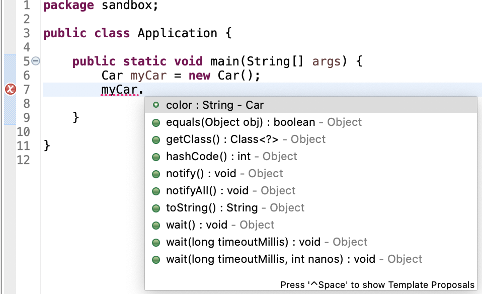

# Introduction to Object Oriented programming

## Objectives

- Introduction to Classes
- Homework exercises
- Guidelines

## Introduction to Classes

- Classes are the fundamental components of `Object Oriented Programming`
- Before moving on, we need to understand what `objects` are, they are the key to understanding the object oriented terminology.
- Now, just to play a bit, turn your head and look around you. You will find many examples of real world objects. For example I am looking around me and I can see the following:
  - A computer
  - A monitor
  - A chair
  - A keyboard
  - A door
  - A phone
  - Headphones
  - etc
- Real world objects have two major characteristics:
  - state
  - behavior

Now, let's pick the following object, the `computer` and analyze its characteristics:

- State:
  - The amount of RAM
  - The Operating System that it runs
  - The Hard Drive capacity
  - The size of the monitor
  - etc.
- Behavior:
  - Booting up
  - Shutting down
  - Beeping
  - Printing
  - Playing movies
  - Playing music
  - etc.

Let's take another real world example, like a `car`:

- State:
  - Color
  - Make
  - Model
  - Engine capacity
  - Seats number
  - Doors number
  - Year of fabrication
  - etc.
- Behavior:
  - Starts the engine
  - Moving
  - Starts the AC
  - Driving
  - etc.

When coming to Software Objects, they are inspired from the real world objects. This means that they also have state and behavior.

- The `state`, in objects is represented by `fields` or `attributes` (they are also referred to as properties but we will stick to the `fields` notation)
- The `behavior` of the software objects is exposed via `methods` (we talked about them in the beginning of the course)

Now you might think, `ok, we know about objects but the lesson is about classes`, well, the class is like the `template` or the `blueprint` for creating objects.

- For example, let's suppose you want to make some cakes but for that, you need a cake shape where you can pour all the ingredients.
- Here, you can see the Cake Shape as the `Class`, the ingredients as the `fields` or `attributes` and the resulting `cake` as the object

- Just think for the class that it is responsible for creating objects. There are a lot of different definitions about what a class is over the internet, they all mean the same thing but using different words :)

- Until now, we have used classes for every single exercies that we performed, for example, the following snippet might look familiar to you:
  ```java
      public class Main{
          public static void main(String[] args){
              // Code goes here
          }
      }
  ```
- Now you might think: "Well, why do I need classes as I managed to do it before them until now?"
- The answer is in the name of the data types that we have used so far, namely the `primitives`. There is so little that you can do with them and thus, you can only describe basic things. If you want, for example, to describe a person, you can, for sure, to declare variables for holding the age, sex, nationality, etc but it will be very hard for you to observe from the first that this is referring to a person.
- Classes can be seen like a custom data type, inspired from the real world, where you will use primitives in order to describe the state and the behavior of the future objects resulting from a certain class.

- Now, let's create a new class:

  - The steps for creating a class are very simple:
    1. Right click the `src` folder or the `package` where you want to class to be saved
    2. Select `New->Class`
    3. Choose a Name
    4. As we want to create a class that represents something from the real world, we don't need the main method inside it, thus, do not check the box that it will create the main method
    5. After the class is created, it should automatically be opened by the Eclipse IDE

- Note: there is a convention to name the classes starting with an uppercase letter and then, each following word from its name, to start with a capital letter. See the examples below:
  ```json
      Good        Bad
      Car         car
      DataStore   dataStore
                  DATASTORE
                  data_store
  ```
  - also, if you remember from our previous lessons, there are some rules when speaking about the characters that can be used in the name of a class.
- After your class is created, it should look similar to the one below: (of course, the name might vary but the structure should be similar):

  ```java
      public class Car {

      }
  ```

- If you want to see more details about what happened behind the scene, right click the class in the package explorer, select `Show in -> System explorer`
- This will take you to the exact location, on your disk, where this java class has been created and here you can open the class file with any editor of your choince
- Now, you might wonder what is the `public` keyword about, well, this is called an `access modifier` and simply refers to what access do we want to allow others to have to this new class.
  - Long story short, `public` means unrestricted access to the class
  - In the future, we will go in details about other access modifiers, until then, just use `public` for your classes
- The next part, in making our newly created class useful, is to create some variables that are part of this class

  - Until now, you have only seen variables created in methods (main method and other custom method), these variables are called `local variables` because they are local to that specific method, meaning that once you get out of the method, the variables do not exist anymore.
  - Classes allow us to create variables that are accessbile to all the methods in the class. These are also known as `member variables` but as we spoked at the beginning of this lesson, most commonly they are referred to as `fields`.

  - Regarding the declaration of a class `field`, we also can (and should) use access modifiers here. Unlike for classes which most commonly are `public`, fields usually have the `private` access modifier. This is because you should always adhere to the principle of `encapsulation` which is a key fundamental rule of `object-oriented programming`. In a very short sentence, `encapsulation` refers to hiding the internal state of an object from the outside eyes, and only expose the functionality that we want. Remember, an object is an entity created from our blueprint, from our class.

  - Now, let's create a new class field for our brand new class `Car`. The field will hold the brand of the car. First, let's take a look at how it is looking and then we will take each part and discuss it:

```java
    public class Car {
        private String brand;

    }
```

- Now, we have talked about the `private` keyword, it simply means that no one from the outside of this class can access this field
- The following should look pretty similar to what you have done so far, countless time, when declaring a variable. As you can see, after we specify the `access modifier` we have to specify the type and the name of the `field`, which we will use when referring to it, while using it across the class
- Another very important thing that you should notice is the positioning of the `field`. The fields are placed inside the class's braces and usually at the top of the class, starting with the very first line after the opening brace of the class
- The name of the field should follow the same rules as for simple variables, you should start with a lowercasee letter and then, each following word should use an uppercase letter. If you want to know more about the naming, you can revisit the lesson that we had in the very beginning of this course.
- The fields of a class can be seen as the characteristics of that specific class. In our example, the brand field indicates us what brand does a specific car has. Of course, we can create as many field as we want. And that's why we will create a few more fields for our class as in the snippet below:

```java
    public class Car {
	    private String brand;
	    private String model;
	    private int doors;
	    private int engineCapacity;
	    private String color;
}
```

- Now the class has more characteristics that we can use in order to create our own `Car` objects. Just notice that apart from the `private` keyword, they look like basic variable.
- For the `Car` class above, we can say that we have defined the state or the caractheristics that each object will have.
  - Again, the class is the blueprint which we will use to create objects, or, you can see it like a bread factory, which produces bread, thus, bread being the concrete object.
- Now, the next logic step is to create an object from this class. Usually, the objects are created in different java files. In our case, we will still have one class responsible just for running the application and another one (i.e `Car`) which will be used in the main method from the `Application` class
  - NOTE: the class that contains the `main` method can be named whatever you want. As a good practice, is usually a good idea to use a name good enough to reflect that it is the entry point of your application, meaning that it contains the `main` method.
- So, now, if we don't have another class which contains the `main` method, we can create one now. I will name it Application but you can choose whatever it fits you.
- Now, in the `main` method we will create an object of type `Car`. It will look very similar for you, you can see it similar to declaring an `int` variable for example, only that now, the type is `Car`:
```java
  public class Main {

    public static void main(String[] args) {
        Car myCar;
    }
}
```
- As in case of creating an int variable, we should initialize our object. Right now, the value of our car object is `null`. This is the default value for objects. If we are talking about primitives, the default value dependes on their type, see below the default value for the most common primitive types:
  |Type|Default value|
  |---|---|
  |int|0|
  |double|0.0|
  |boolean|false|
- Ok, so in order to initialize our object, we will again, type something which should look pretty familiar to you:
```java
  public class Main {

    public static void main(String[] args) {
        Car myCar = new Car();
    }
}
```
  - For sure, you remember using this syntax when creating a new Scanner, for example.
  - We use the keyword `new` whenever we want to create new objects of certain type. 

NOTE: it is very common to say `instantiate the object x` when we create a new object. So this process is called `instantiation`. 

Due to what we have written above, we can give a  definition for an object as:  `An object is an instance of a certain class from which we want to create objects`.

- If we remember, from previous lessons, we said that you can differentiate between simple variables of primitive type and object types if we type `.` after the name of the variable/object and something appears or not.
  - If you will see a dialog open with some methods, fields, it means that you have an object, otherwise it is a simple primitive variable.
  - In our case, if on the next line we type `myCar.` a dialog will open, similar to the one in the image below:
  
- Now, you might have two questions:
  1. Where does these methods come from?
  2. Why there is nothing related to the state that we have defined for our class?
- We can postpone the answer to the first question for the next lessons when we will learn about a new pillar of the OOP, namely the `inheritance`. Until then, we can answer to the second one:
  - First of all, we cannot see anything because, if you remember, we have all the fields set as `private` and that's how they should be. You should really have very good reasons not to make them `private`. But, for the sake of the test, let's make the `color` field `public` and then get back into the `main` method and press the `.` character again. Pay attention to the current content of the dialog:

  
  - Now, we can see the field for which we have changed its access modifier. Now, switch it back to `private` and let's move forward with this topic.

- So, we know that the fields should be private and we cannot see them from the outside...then, how do we even use them?
  - In order to answer this question, we need to talk about two things:
    1. Constructors
    2. Methods

- The constructor is a very simple thing yet very important in the lifecycle of the object. You have already used a constructor when you have initialized the `Car` object, namely: `new Car()`.
  - This is the so called `default constructor`, JAVA will create a `hidden` constructor for you, if you haven't defined one.
  - The syntax of a constructor is pretty similar to a method only that it does not have a return type and SHOULD HAVE THE NAME OF THE CLASS. That's the simplest and fastest way to recognize a constructor in a class: `it has the same name with the class`.
  - Now, let's move into the `Car` class and create our new constructor in which we will place a print statement, just to see that our constructor got called and not the default one:
    ```java
      public class Car {
        private String brand;
        private String model;
        private int doors;
        private int engineCapacity;
        public String color;
        
        public Car() {
          System.out.println("I am a printing from inside the constructor");
        }
    }
    ```
  - In the console, you should have the following message printed: `I am a printing from inside the constructor`;
- Of course, the role of the constructor is not to print messages but rather to initialize the fields/state of the class.
- The following syntax might look a lot weird for you but trust me, you will use it so often that it will become very familiar. We want to initialize all the fields from this Car class inside our constructor:
  ```java
    public class Car {
        private String brand;
        private String model;
        private int doors;
        private int engineCapacity;
        public String color;
        
        public Car(String brand, String model, int doors, int engineCapacity, String color) {
          this.brand = brand;
          this.model = model;
          this.doors = doors;
          this.engineCapacity = engineCapacity;
          this.color = color;
        }
    }
  ```
  - Now let's take the updates one by one
    - first of all, we said the the constructor is just a method with some special characteristics (namely it is used to instantiate the fields of the class). Because it is also a method, the constructor receives the data that will be used to initialize the fields of our class, as parameters, same as for methods
    - You see that we have one parameter for each of our field. Of course, the name can be different but the type should be the same! There is a rule of thumb to use the same name even though for now it might look like a name colission with the name of the class fields, but this issue is solved by the `this` keyword. We will talk a lot over it in the next lessons but for now, think to it as to a flag which simply says "`I represent the object that will be created from the class`". And this can be read as: `Set the brand field of the object to have the same value as the brand parameter; Set the model field of the object to have the same value as the field parameter; etc`
- We have initialized all of our fields (and this is a good practice that you should follow. Avoid having fields which are not initialized in the constructor) but now, if we run the main method, an error will be thrown:
  ```java
    Exception in thread "main" java.lang.Error: Unresolved compilation problem: 
	The constructor Car() is undefined at sandbox.Application.main(Application.java:6)
  ```
  - So what happened to our default constructor created by JAVA for us? Well... it is gone! JAVA will create a default constructor IF AND ONLY IF you do not define your own constructor. As soon as you have your custom constructor, the default one will not be available anymore.
  - In order to make the application run again, we should update the call to our constructor. Yes, we have used the same term as for a method: `call`, because that's what we are doing, we are calling a method which constructs our object, that's why it is named a `constructor`
  - Now, we should pass data to our constructor to match the types that it expects. An example will be the one below:
    ```java
          public Car(String brand, String model, int doors, int engineCapacity, String color) {
            this.brand = brand;
            this.model = model;
            this.doors = doors;
            this.engineCapacity = engineCapacity;
            this.color = color;
          }
    ```
  - The program compiles for now  but still, it does not help us yet what we have done because we have initialized the internal state of the object, but there is no way to access it due to the private access modifier.
  - In order to access the value of the fields, we will create `getters`, which are simply methods that return the value of a certain field. The definition of the method will be very similar to what you have used in the previous lessons with the difference that you will not use the `static` keyword because the method will be attached to an object now. This means that you should have an instance of the class in order to access it.
  - After creating the getters for our class, it will look like in the snippet below
    ```java
      public class Car {
          private String brand;
          private String model;
          private int doors;
          private int engineCapacity;
          public String color;
          
          public Car(String brand, String model, int doors, int engineCapacity, String color) {
            this.brand = brand;
            this.model = model;
            this.doors = doors;
            this.engineCapacity = engineCapacity;
            this.color = color;
          }
          
          public String getBrand() {
            return this.brand;
          }
          
          public String getModel() {
            return this.model;
          }
          
          public int getDoors() {
            return this.doors;
          }
          
          public int getEngineCapacity() {
            return this.engineCapacity;
          }
          
          public String getColor() {
            return this.color;
          }
      }

    ```
 - Now, we have a way to retrieve the values stored in our private fields. All the getters that we have defined should be visible when you press the `.`. For example, if we now say `myCar.getColor()` and then print the returned value, the color of myCar object will be printed:
  ```java

    public class Application {

        public static void main(String[] args) {
          Car myCar = new Car("Volkswagen", "Golf", 5, 1500, "Blue");
          System.out.print(myCar.getColor());
        }
    }
  ```
- We have talked a bit about constructors and getters, let's talk a bit also about multiple objects of same type.
- Now that we have the blueprint (the class) we can create multiple objects from it, it is like reusing the cake shape to create multiple cakes. But, as for cakes, even though we reuse the same cake shape, a different cake will come out, and also reusing our constructor, will give birth to a different object. These can be seen in the snippet below:
  ```java
      public class Application {

        public static void main(String[] args) {
          Car andreiCar = new Car("Volkswagen", "Golf", 5, 1500, "Blue");
          Car bogdanCar = new Car("Seat", "Leon", 5, 1595, "Red");
          
          System.out.print(andreiCar.getColor()); //It will print Blue
          System.out.println(bogdanCar.getColor()); //it will print Red
        }
      }
  ```
- You can see that we have used the same class constructor, but with different parameters. It is the same as calling a method, multiple times with different parameters.
- Of course, we have obtained different results because we have passed different values to the constructor. If we were to pass exactly the same parameters to both constructor call, indeed, the `getColor` call will return the same value but the objects, will still be different, independent objects. But before prooving you this, let's talk about the ``setters``

- Setters are the opposite of the `getters`, they are used to setting different values for the fields of a certain class. This means that after initializing the fields via the constructor, if you want to change their values, the setters are the right way to do it.
- Regarding their syntax, the setters are simple methods which receive usually one parameters with the same type of the field that they want to update and void type. 
- After adding also the setters, our `Car` class now looks like in the snippet below:
  ```java
      public class Car {
          private String brand;
          private String model;
          private int doors;
          private int engineCapacity;
          private String color;
          
          public Car(String brand, String model, int doors, int engineCapacity, String color) {
            this.brand = brand;
            this.model = model;
            this.doors = doors;
            this.engineCapacity = engineCapacity;
            this.color = color;
          }
          
          public String getBrand() {
            return this.brand;
          }
          
          public String getModel() {
            return this.model;
          }
          
          public int getDoors() {
            return this.doors;
          }
          
          public int getEngineCapacity() {
            return this.engineCapacity;
          }
          
          public String getColor() {
            return this.color;
          }

        public void setBrand(String brand) {
          this.brand = brand;
        }

        public void setModel(String model) {
          this.model = model;
        }

        public void setDoors(int doors) {
          this.doors = doors;
        }

        public void setEngineCapacity(int engineCapacity) {
          this.engineCapacity = engineCapacity;
        }

        public void setColor(String color) {
          this.color = color;
        }
      }

  ```
- As you can see, each setter has the name starting with `set` and then followed by the name of the field that is setting up and due to the fact that it has no return type, it has the `void` in its definition.
- Let's get back to our previous idea, where we create two `Car` objects using the same parameters for the constructor. In order to demonstrate that each object is independent from other objects created from the same constructor with same date, let's take a look to the snippet below:
  ```java
    package sandbox;
      public class Application {

        public static void main(String[] args) {
          Car andreiCar = new Car("Volkswagen", "Golf", 5, 1500, "Blue");
          Car bogdanCar = new Car("Volkswagen", "Golf", 5, 1500, "Blue");
          
          System.out.println("Before changing the color:");
          System.out.println(andreiCar.getColor()); //It will print Blue
          System.out.println(bogdanCar.getColor()); //it will print Blue
          
          
          bogdanCar.setColor("Red");
          System.out.println("After changing the color: ");
          System.out.println(andreiCar.getColor()); //It will print Blue
          System.out.println(bogdanCar.getColor()); //it will print Red
          
        }

      }

  ```
- After calling the `setColor` method, the object named `bogdanCar`, will have a different value for the `color` field. This illustrates how each object is isolated from another object created from the same class. 
- Usually, you say we have 2 different instances of the `Car` class, if we are in the same situation as above.
- For now, we will stop it here. In the next lesson we will have a deep dive into the constructors and `this` keyword.

## Homework exercises

1. Take an animal of your choice, and imagine it as an object. Try to describe its behavior and state as in the class examples
2. Create a class which will describe a BankAccount. The class should have the following fields: iban, first name of the owner, last name of the owner, amount, currency. Then you should expose these fields only via getters. Also, the field should be updated only via setters.
3. After creating the class for the previous exercise, create multiple instances of it, and then print the field values for each of the instances.

## Guidelines
- Try to re-visit the chapter where we have discussed about methods, their return type, their definition, etc. It will help you
- Write down the differences between a method and a constructor
- Write down the similarities between a method and a constructor
- Make sure you understand the topics that were discussed today, if not, please remind me at the beginning of the next course to re-visit the topics which were harder to pick. It is crucial to understand them while moving forward.