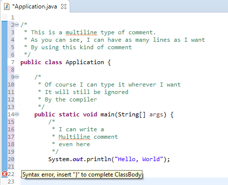
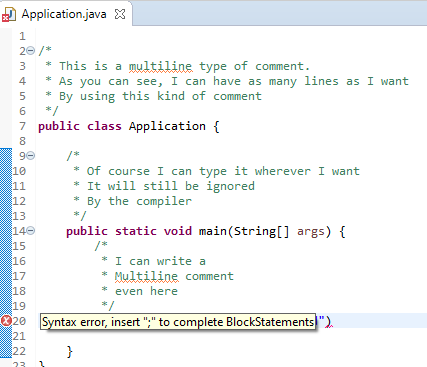

# Introduction to Java Programming Part 2

## Objectives
- Recap the first session
- Dissecating the Hello World example
- Common mistakes and how to fix them
- Homework exercises
- Guidelines

## Recap the first session
- How does it look like the language spoken by computers?
- What is a programming language?
- What is the difference between a low-level language and a high level language?
- What kind of language is JAVA and why?
- What do you understand by running a JAVA application?
- What is a .java file?
- What is a .class file?
- What is `bytecode`?
- What do you understand by JVM?
- What is an IDE?
- Why do we need it?
- What is an Eclipse workspace?

## 1. Dissecating the Hello World example

- Java has a free form layout, meaning that we can use any number of spaces and line breaks to separate words
- We can have as many words as possibile into each line
- For example, our `HelloWorld` example looked like this:
    - ```JAVA
        public class Application {

            public static void main(String[] args) {
                // TODO Auto-generated method stub
                System.out.println("Hello, World");
            }
        }
      ```
- But there is no rule to enforce us to strictly use this layout, we can, for example, write our code in the following format and it will still run:
    - ```JAVA
        public class Application {public static void main(String[] args) {System.out.println("Hello, World");}}
        ```
- Nevertheless, the advantage of using the previous format, is obvious! Our code is much more readable and this is the direction that we should follow.

- The outer most part of our hello world application is something called a class:
    - ```JAVA
        public class Application { 
            // code goes here
        }
        ```
    - For now, just ignore the keyword `public`, we will speak about it a later time.
    - Most of your time, while developing JAVA applications, you will create classes.
    - In JAVA, we will definitely have at least one class, the one which will be responsible with running your application.
    - I say at least one because you can have as much code as you want inside this class which will run your program but this is not desirable because the code will be hard to read
    - We will see later, when we'll have the introduction to the Object Oriented paradigm, how can we have multiple classes and why we should.
    - We can have many classes in a file which has the extension .java with the following restrictions:
        1. We can only have one `public class` in a java file (do not bother about what this `public` means for now) and as many non public class as we want. A non public class is simply a class which does not have the keyword public:
            ```JAVA
            class OtherApplication{
                //Code goes here
            }
            ```
        2. The name of the file should match the name of the public class ad literam. If our public class is named `BankingApplication`, the file should have the following name: `BankingApplication.java`
        3. We know from the first rule that we can only have one public class in a java file but it is also mandatory. We cannot have a java file without a public class.
    - Usually, the name of the class starts with an uppercase letter. Also you cannot use a space when naming a class. Also, you cannot use names that start with a digit.

- Also, it is very important to note that the code coresponding to this class is enclosed by braces: `{}`
- Everything that is inside of these braces is called `the scope` and due to the fact that they are attached to the `Application` class, we can easily say that everything that is inside these braces which open right before the Application word and closes at the end of the file, it is called the `scope of the Application class`

- The next part, is something which is called a comment:
    - ```JAVA
        // TODO Auto-generated method stub
        ```
    - Its content, is not important, it merely says, well this piece is autogenerated by the IDE, feel free to add more to it.
    - A comment is something which is ignored by the compiler. This means that we can type whatever we want, even something which does not adhere to the JAVA language syntax.
    - The purpose of comments is to describe what is that piece of code supposed to do.
    - For example we can have the following comment which explains a bit what does each part of our application do:
        - ```JAVA 
            // This is the class that contains the HelloWorld Java application
            public class Application {
                
                // This is the most important method in every Java application
                public static void main(String[] args) {
                    // TODO Auto-generated method stub
                    System.out.println("Hello, World");
                }
            }
            ```
- There are multiple ways to define a comment:
    - The first one and the one you have seen previously, is called a line comment
        - The line comment starts with a double forward slash and everything which follows it,on the same line, it is igonored by the compiler
    - The next type of comment is called: `multi line comment`
        - This comment can span across multiple lines
        - The compiler will ignore everthing which is enclosed between `/*` and `*/` as in the example below:
        - ```JAVA
            /*
            * This is a multiline type of comment.
            * As you can see, I can have as many lines as I want
            * By using this kind of comment
            */
            public class Application {
                
                /*
                * Of course I can type it wherever I want
                * It will still be ignored
                * By the compiler
                */
                public static void main(String[] args) {
                    /*
                    * I can write a
                    * Multiline comment 
                    * even here
                    */
                    System.out.println("Hello, World");
                }
            }
            ```
    - There is also a third type of comment which is called the documentation comment. It has the same syntax as the the multi line comment but it adds some pieces of information. For now, we can stick with the first two types and we'll come back at this type of comment after we learn more about something called `methods`.

- After we move after the comment generated by our IDE, we reach the most important thing in every JAVA application: `the main method`
    - First of all, it is called main because it is the entry point to your application
        - Whenever someone tries to run your application, the Java Virtual Machine will look for this `main` method
    - You might wonder, well, the idea with main is pretty simple, it is the entrypoint and so on, but what is a method?
    - Well, a method is only a grouping of code. I know that our current method is more complicated because it is also the main method, it is still just a grouping of code, we stack here the code that we want for our application.
    - So when someone says `a java method`, you can imagine a group of lines that contains JAVA code.
    - You can see that also methods have their code enclosed between braces like: `{}`. Similar as for the classes, everthing which is enclosed between the braces that belong to a method, is called `the scope of the method`
    - Another very important characteristinc of the main method is the fact that is should look exactly as it looks here. And I am referring to this part:
        - ```JAVA
            public static void main(String[] args)
            ```
    - Just to have a rough idea of each part, we will briefly discuss every word from the phrase above but don't bother if it is not clear for now, we will have plenty of time to learn it:
        - ```public``` -> This word refers to the visibility of our method, or, shortly, if it is accessible or not from other code that resides in a different file and/or application. There are also other type of visibility but we will discuss them later
        - ```static``` -> This means that the method does not need any object in order to run. We will see later, when we will enter the world of Object Oriented Programming that if we create an object, we can define a method without using this word of `static`
        - ```void``` -> This refers to the fact that our method does not return anything. We will dedicate the next lessons to learn more about methods and return types but for now, think to the fact that a method can return something (maybe you want it to compute an addition and return the result) or it might not return anything, thus we have to specify the `void` keyword
        - `main` -> Usually, after we specify the visibility of the method (in our case `public`) and if the method returns or not something (in our case `void`) we type the name of the method. In our case, it is a name but also, it is the `main` method, the entry point from outside world to our application
        - `String[] args` -> These words represents the parameters of the method. You can see it as the data which can be used by our method in order to perform a certain operation.  `String` here means that we can received parameters as text and the brackets after means that we can have more elements. `[]` means that we have an array of parameters. Also, don't bother with these words for now, we will talk more about them later. and `args` here is just a name, how can we refer to these text chunks if we want to use them in our method.

- For sure, the most interesting part from our hello world example, is the following line:
    ```JAVA
        System.out.println("Hello, World");
    ```
    - This line, simply put is printing the message which is specified between the `""`
    - But, if we analyze it carefully, it is more than that:
        - `System` is also a special type of class
        - `out` is an object which is part of the `System` class
        - `println` is a method which simply prints an expression which can be a string or even a math computation. Note the `ln` at the end of this method, which simply says that any other following output should be displayed on the next line. Of course, there is a similar method to `println` which does not move any upcoming content to the next line. This is named `print`
    - Take a look below for a better understanding of these two methods:

        ```JAVA
        public class Application {

            public static void main(String[] args) {
                // This will print the string passed between "" and whatever needs to be printed afterwards, will be printed on the next line
                System.out.println("My Name is Bogdan Niculeasa");
                //Here we are using the print version and we will not move to the next line any future print statements
                System.out.print("I am a programmer");
                System.out.print(" - this should be on the same line with the previous statement");
            }
        }
        ```
        The output of the previous snippet will be:
        ```
            My Name is Bogdan Niculeasa
            I am a programmer - this should be on the same line with the previous statement
        ```
    - We can also perform math operations and display them using the `System.out.print` and `System.out.println` methods:
        ```JAVA
        public class Application {

            public static void main(String[] args) {
                // The first print will just display what are our intents
                System.out.print("3 + 3 = ");
                // The second print will display the result of adding two numbers
                System.out.print(3+3);
            }
        }
        ```
        - It should display: `3 + 3 = 6`
        - Of course, you can compute any math operation, for example, if we want to perform a multiplication, a simple change of the `+` sign into `*` will perform the trick:
        ```JAVA
            public class Application {

            public static void main(String[] args) {
                // The first print will just display what are our intents only that now we multiply the numbers
                System.out.print("3 * 3 = ");
                // The second print will display the result of multiplying two numbers
                System.out.print(3+3);
            }
        }
        ```
    - Of course we can print not only text, but also math expression and objects for example but we will see this
- Note that we should end our statements with `;` otherwise our compiler will complain about it. 
    - If it is confusing for you when to put or not the semicolon, just remember that you should put it always at the end of the line if the line contains JAVA code but you should not use it if the previous character is a closing brace (`}`). That's why we have semicolon only at the end of the printing statement.

## 2. Common mistakes and how to fix them
- Java is `case sensitive`. Not paying attention to this characteristic, it might throw an error
- Everytime you open a paranthesis, make sure that you close it. This means that if you have a `{`, `[` or `(` you should always have a closing match ( `}`, `]`, `)` ). Same as in math.
    - Usually, your IDE will throw an error, and the message should be pretty straightforward
    - For example, if I delete the ending brace for our class, Eclipse will throw the following error:
         
    - You can see that the message not only tells you what the problem is but also where. This means that if you put a closing brace at line 22, the error will disappear.
- Missing semicolon:
    - Every code statement should end with a semicolon. Remember that if the last character is a closing brace, you should not use the semicolon.
    - If you forgot to type a semicolon (`;`), again the IDE will complain and it will throw an error with a helpfull message.
    - In our case, Eclipse will do the following if we forgot to put the semicolon:
         
    - You see that again, Eclipse will tell you what is missing and also where (n.r line 20)
- Of course, there are more type of errors and pitfalls but we will tackle them all, one by one as we encounter them. But remember the fact that the message which is displayed by your IDE can help you to identify the root problem and if it is not clear for you, you can search over the internet because there is a high chance that someone else also had this issue.


## Homework exercises
1. Create a java project called BankingApp. Inside this folder create the public class `Application` and two other classes called:
    - `User`
    - `Account`
Play with them by adding and removing the public keyword, analyse the error message thrown such that it will be easier for you in the future to fix the error if you encounter it.

2. Create a java project which will display the following text:
    - `123 + 323 = 446`
    - NOTE: it should display only one line (hint: think which method does print on the same line) and also, the result should be computed by the computer, this means that you should perform the addition (See the example at the beginning of this lesson)

3. In the same java project used for the previous exercises, on a new line, display your name together with your age as follows: `Bogdan Niculeasa, 28 years.`
    - Note: the text should be printed right below the computation performed for the second exercises

4. Create a java project in which you will compute the multiplication of two floating point numbers, of your choice. A floating point number is simply a number with decimals like: `3.121`, `3.545`, `6.434`, `7.9`, etc.
    - Also for this exercise, print the operation before, such that we know how we got the result.
    - For example, if I want to display the result of multiplying 5.1 by 4.2 I should not just directly print `21.42` instead, before computing the result, I should have something like: `5.1 * 4.2 = ` and then print `21.42`.
    - It's your choice of how the operation should be displayed, either on one line or two lines.
5. What does the Following set of Statements Print?
    ```JAVA
    System.out.print("My lucky number is");
    System.out.println(3 + 4 + 5);
    ```
6. Give 5 examples of legal class names and 5 examples of illegal class names. Hint: use your IDE

7. How can you define a comment with your own words? Give an example of a commented code and uncommented code

## Guidelines
- It is always a great idea to type yourself the code that you are seeing it, even if you really understands what is doing.
- Practice by typing, this will make you more familiar with typing and also with the programming language itself.
- Experiment by deleting certain character, braces, just to make you familliar with the thrown errors.