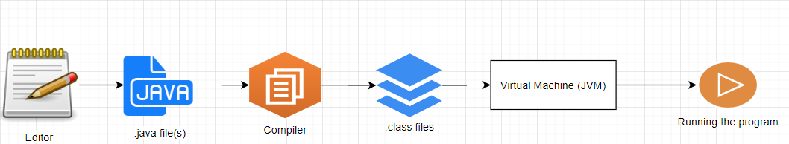

# Recap First and Second sessions + exercises

## Objectives
- Recap the second session
- Class exercises
- Homework Exercises

## Recap the second session
- What is a class?
- What is a method?
- What is a string and how can you display it?
- What is a comment? Is it usefull?
- How many types of comments do you know?

- Before moving forwards, it makes sense to see, graphically, how does the process of creating and running an application looks like; starting with writing it and then running it on the system. Take a look at the image below: 
     


## Class Exercises

1. Write a JAVA program that displays your name inside a box on the console screen like:
    ```JAVA
        +------+
        |BOGDAN|
        +------+
    ```
    - Solution:
        ```JAVA
        public class Application {

            public static void main(String[] args) {
                System.out.println("+------+");
                System.out.println("|BOGDAN|");
                System.out.println("+------+");
            }
        }
        ```
2. Write a program that prints a face, similar to the one below:
    ```
           //////
         | o    o |
        (|   ^    |)
         |  [__]  |
         |________|
    ```
    - Solution:
        ```JAVA
            public class Application {
                public static void main(String[] args) {
                    System.out.println("   //////  ");
                    System.out.println(" | o   o  |");
                    System.out.println("(|   ^    |)");
                    System.out.println(" |  [__]  |");
                    System.out.println(" |________|");
                }
            }
        ```
3. Write a JAVA application that displays the following recangle:
    ```JAVA
        **************
        *            *
        *            *
        **************
    ```
    - Solution:
        ```JAVA
            public class Application {

                public static void main(String[] args) {
                    System.out.println("**************");
                    System.out.println("*            *");
                    System.out.println("*            *");
                    System.out.println("**************");
                }
            }
        ```
4. Write a Java program which computes the average of the following numbers: 3,6,9.
    - Solution: 
        ```JAVA
            public class Application {

                public static void main(String[] args) {
                    System.out.print("The average of 3,7, and 9 is: ");
                    System.out.println((3+6+9)/3);
                }
            }
        ```
5. Write a JAVA program that displays the sum of the first 15 positive numbers:
    - Solution:
        ```JAVA
            public class Application {

                public static void main(String[] args) {
                    System.out.print("The sum of the first 15 positive numbers is: ");
                    System.out.println((15*16)/2);
                }
            }
        ```
6. Write a JAVA program that computes the pythagorean theorem for a right triangle having the sides equal to 3 and 4.
    - Solution
    ```JAVA
        public class Application {

        public static void main(String[] args) {
            System.out.print("The pythagorean theorem for the right triangle with two sides equal to 3 and 4 is ");
            System.out.println(Math.sqrt(4*4+3*3));
        }
    }
    ```
## Homework exercises

1. Write a JAVA program that displays your name inside a book on the console screen like:
    ```JAVA
        ********
        |BOGDAN|
        ********
    ```
2. Write a JAVA program that displays the following pattern:
    ```JAVA
        \______/
        ( o ^ o)
         ------
    ```

3. Write a JAVA program which displays a TicTacToe board:
    ```JAVA
        +------+------+------+
        |      |      |      |
        +------+------+------+
        |      |      |      |
        +------+------+------+
        |      |      |      |
        +------+------+------+
    ```

4. Write a JAVA program that displays the following stairs:
    ```JAVA
                             +------+
                             |      |
                      +------+------+
                      |      |      |
               +------+------+------+
               |      |      |      |
        +------+------+------+------+
        |      |      |      |      |
        +------+------+------+------+
    ```
5. Write a JAVA application that displays the following half pyramid
    ```JAVA
        *
        * *
        * * *
        * * * *
        * * * * *
    ```

6. Write a JAVA program that displays the following inverted pyramid 
    ```JAVA
        * * * * *
        * * * *
        * * * 
        * *
        *
    ```

7. Write a JAVA application that displays an inverted pyramid but now with digits:
    ```JAVA
        1 2 3 4 5
        1 2 3 4 
        1 2 3
        1 2
        1
    ```

8. Write a JAVA application which computes the average of the following numbers: 123, 213, 432.

9. Write a JAVA program which computes the average of the following numbers: 3,7 and 9. Check your result with a computer. What did you notice? 

10. Write a JAVA program which computes the volume of a Cone with base equals 6 and height equals 10.


## Guidelines
- Whenever you are stuck, just search on your favorith search engine (e.g google). For example, if you don't know the formula for the volume of a Cone, just search over the internet.
- As repetitive it might get, try for each exercise to create a new JAVA project. This way you will have a lot of practicing exercise 