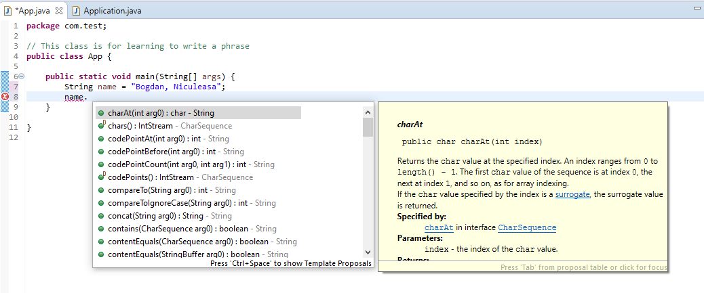

# Introduction to JAVA methods, variables and primitive data types


## Objectives
- Recap previous sessions
- Variables
- Short introduction to objects, classes and methods
- JAVA Number types
- Homework exercises

## Recap previous sessions
- What is a class?
- How many classes can be in a single .java file?
- Can we have two public classes in the same .java file?
- What is the relationship between a .java file and the public class inside this file?


## Variables

- A program is said to be useful if it does more than just displaying strings or numbers. This means that most of the time, a program represents items from real life, making an abstraction of them such that it is easier for us to work with them. 
    - For exampe, if we were to create a Software application for a banking system, we would have to abstract entities like `accounts`, `employee`, `records`, etc. in our program.

- In JAVA, these entities that we are making an abstractions of are called `objects`. And in the next lessons, we will see how can we add behavior to these objects by creating our own classes.

- So far, we have played with texts and numbers so we have encountered some data types. Thus it is crucial to understand that in JAVA, every value has a `type`:
    - `Hello, World` is a `String`
    - `23` has the type `int` (just an abbreviation for integer)

- It is very important to know the type of the value we are working on because the type is the one who decides what can you do with that value.
    - For example, you cannot compute the multiplication of two strings but for sure you can compute it for two integers.

- Most of the time, you will want to store a value such that it can be easily reused at a later time.

- In order to remember a value, or simply said to store it, we need a `variable`.
- A `variable` is a storage location in the computer's memory that has a `type`, a `name` and some `content`
    - `type` -> specifies what kind of values can this variable hold
    - `name` -> is used to reference the value store by the variable, in different places.
    - `content` -> is the actual value stored at a certain memory location to which the variable makes a reference.
- Let's see some examples of variables:
    - `String greeting = "Hello, World";`
    - `int age = 44`;
- Can you identify in the previous examples which is the `type, name` and `content` of each variable?
- As we said,  we create variables in order to reuse them later, instead of redefining a certain value. This means that variables can be used in place of the values that they store:
    - We can replace:
        ```JAVA
            System.out.println("Hello, World");
        ```
    - With:
        ```JAVA
           String greeting = "Hello, World";
           System.out.println(greeting)
        ```
- Now you might think: `Why would I do this if I can simply type the value? Also, by directly typing the value, I only have one line of code.`
    - Well, think that before printing, for example, you might want to do some transformation to the text that you want to print. Meaning, for example, you might want to transform the text all in UPPERCASE, and this is very simple due to the fact that the `String` type already has built-in functionality for text manipulation:
        ```JAVA
            String greeting = "Hello, World";
            System.out.println(greeting.toUpperCase());

        ```
    - Or maybe you have a text containing a certain code, which you are the only one who knows what it means. Thus, you can create a variable which has a name that suggests what does that value represent.

- Whenever you create a variable, there are just two decisions you have to take:
    1. What type should I use for the variable?
        - This is highly influenced by what kind of value do I want to store. If it is a text, I would want a `String`, if it is a number, then an `int`, etc.
        - Also note that it is an error to store a value whose type does not match the type of the variable. For example, if we want to store the number `28` in a String variable, the compiler will throw an error.
    2. What name should I give to the variable?
        - Giving a good name is the most important thing when defining a variable. This name will emphasize what the value will represent, what is its meaning.
        - For example, variable name `firstName` is a better choice than the name `f`.

### Rules when naming a variable
-  A name or identifier can be made up of letters, digits and the underscore (`_`) and dollar sign(`$`). But it cannot start with a digit and it cannot be built only from digits:
    - `greeting9` is legal
    - `9greeting` is illegal
- You cannot use other symbols such as `?` or `%`. For example, `hello!` is not a legal identifier.
- Spaces are not permitted inside identifiers: `lucky number` is not a legal identifier.
- Also keep in mind that there are some reserved words which you cannot use as identifiers. Among them we have:
    - `public`
    - `class`
    - `static`
    - etc.
- Never forget that JAVA is a case sensitive language, this means that `greeting` and `Greeting` are two different identifiers

- Some other guidelines:
    - By convention, variable names usuallys tart with a lowercase letter and class names with an Uppercase letter
    - It is OK to use an occasional uppercase letter such as `luckyNumber`. This mixture of lowercase and uppercase letters is sometimes called `camel case`

### Variables definition
- In order to define a variable, we have to follow the syntax below:
    - `<typeName> <variableName> = <value>` ( e.g String name = "Bogdan, Niculeasa"; )
    - `<typeName> variableName>;` (e.g String name;)
- The difference between them is that the first one also has a value associated with it when the second one does not.

- The most important part of using a variable is the fact that we can change its value, later on.
    - For example, let's suppose we want to declare a variable which holds the name of the user which is logged in into facebook, for example. And, whenever a different user is logged in, we don't want to create a new variable for her/him, just update the value of the variable to be the name of the current user.
    - This is possible using the assignment operator, namely `=`
    - Let's look at the following example:
        - We have the following int variable which holds the age of the current user: `int age = 18;`
        - If we later on want to update its value to say 22, all that we have to do is: `age = 22;`
        - As you saw, there is no need to also type again the type of the variable, just use its name and JAVA will know to which variable you are referring to

- NOTE: There might be a confusion between what the equals sign (`=`) means in math, where it refers to equality and in programming when it refers to assignment.

- Also very important, all variables should be initialized before accessing them, this means that they should have a value associated with them.
- By accessing them, it simply means using the variable as in the example below:
    ```JAVA
    int age;
    age = 21;
    System.out.println(age);
    ```
- The safest choice, if you can, is to initialize the variable as soon as you declare it.

## Short introduction to objects, classes and methods
- An object is an entity that you can manipulate in your program.
- We don't know for sure how an object is organized inside but it has well defined behaviour and that's what we are interested in.
- An object can be manipulated by calling one or more of its methods
- A method consists of a sequence of isntructions that accessess the internal data of the object. 
- For example, so far, we know that `System.out` refers to an object which we manipulated by calling either `print` or `println`. When we call one of these methods, some activities occur inside the object and in the end, the text got displayed in the console.

- We have encountered so far at least two objects:
    - `System.out`
    - `"Hello, World!"`
    These objects belong to different classes, the first one belongs to the class `PrintStream` and the last one belongs to the class `String`
    - Not only we can say that it belongs to some class, but in the same time, we can also say that the type is the same as the class (e.g: `"Hello, World!"` has the type `String`);

- Just as the `PrintStream` class provides the `print` and `println` methods, so does the String class provides its own, different methods.
- In order to see all the methods that are present in the `String` class, define a `String` variable and then, on the next line, type the name of the variable followed by `.` ,a window will appear with all the available methods (Note: this trick with dot is available for all the classes in JAVA)
    ```JAVA
        String name = "Bogdan, Niculeasa"
        name.
    ```
    and something similar to the image below will appear on your screen:
        
- Now let's take a look at some example methods from the `String` class:
    ```Java
        public class App {

            public static void main(String[] args) {
                String name = "Bogdan, Niculeasa";
                //length method returns how many characters are contained in a String
                System.out.println(name.length());
                //toLowerCase method transforms a String in a String using lowercase only letters
                System.out.println(name.toLowerCase());
                //toUpperCase method transforms a String in a String using uppercase only letters
                System.out.println(name.toUpperCase());
            }
        }
    ```
    - as you might noticed, we don't pass anything to these methods, unlike the `print` and `println` methods. That's because some methods expect parameters and some does not.
- Note: Whenever you want to call a method from a certain variable, first make sure that the method is defined for that type.
    - For example, if we call `System.out.length()` an error similar to `The method length() is undefined for the type PrintStream` will be displayed.
- Also to remember, the content displayed in the dialog opened when you type `.` after the name of a variable, it is called the `public interface` of that type.

### Method Parameters and Return values
- Some methods need input in order to perform a certain operation. For example, the `println` method, required a String to be passed as parameterm, just to have what to print on the console.
    - Remember that a parameter is something between `(` and `)`
    - Also, in computer science, a parameter is the technical term for the method input.
- Some methods, require multiple parameters, other required none. For example, the substring method has a version in which you can specify the start index and the end index, and it will return the portion of the string contained between indexes with the  mention that the index starts at 0 and it goes up to the end index but it will not include that index in the output. See the example below.
    ```JAVA
         public class App {

            public static void main(String[] args) {
                String name = "Bogdan, Niculeasa";
                String firstName = name.substring(0, 6);
                System.out.println(firstName);
            }
        }
    ```
    - It is always a good idea to read the documentation of each method when you call it.

- There is another characteristic of some methods. Namely, they can return a value. For example, the `length` method of the `String` type returns how many characters are inside a String variable.
    - We can store the return value or pass it directly to a method. See the example below:
        ```JAVA
        public class App {

            public static void main(String[] args) {
                String name = "Bogdan, Niculeasa";
                //We can store the length in an int variable and pass the variable
                int nameLen = name.length();
                System.out.println(nameLen);
                //Or we can pass directly the call to the .length method and it will have the same result
                System.out.println(name.length());
            }
        }

        ```
        - Don't bother with the int type for now. Just think that is a type that can hold integer numbers, we will look at it in the next section
- Remember that not all methods have to return something.
- Not let's see another  example with a method from the String class, namely the `replace` method:
    ```JAVA
        public class App {

            public static void main(String[] args) {
                String phrase = "I have five dogs";
                //This replace method call will replace the word dogs with cats
                String updatedPhrase = phrase.replace("dogs", "cats");
                System.out.println(updatedPhrase);
            }
        }
    ```
    - Just to have a better understanding of the previous method, the `replace` method looks 
- Note that most of the methods in the String class return another String which will contain the updated value. That's why the following expression is valid:
    ```JAVA
        String name="Bogdan, Niculeasa";
        System.out.println(name.replace("Niculeasa", "Constantin").length());
    ```
     and it will first replace the word `Niculeasa` with `Constantin` and then computes the `length` of the resulting String, namely `Niculeasa, Constantin` which is `21`.

## JAVA Number types

- JAVA has separate types for  `integers` and `floating-point` numbers
    - `integers` => whole numbers (e.g 2, 3, 56, 789, 1212, etc)
    - `floating-point` numbers => numbers that can have fractional parts (e.g 1.3, 2.34, 4.23, 1212.454555, etc)
        - Note that some floating point number might look like integer numbers but they are indeed floating point numbers. (e.g 3.0, 4.0, 5.0, etc.)

- JAVA has different types for whole numbers and floating-point numbers because in some situations, integer numbers have several advantages like: 
    - they take less storage
    - processed faster
    - don't cause rounding errors
    
    but in the same time,  if we want to have more precision, for example when computing distances, grading points, etc, we would go for a floating-point data type like `double`.

- There are multiple types for both integer numbers and floating-point numbers but for now we will stick with two:
    - `int` for representing integer numbers
    - `double` for representing floating point numbers
- VERY IMPORTANT!!!
    - The number types, in JAVA, are called primitives and not classes and that's why, they have no methods.
    - For example, if we have the following variable:
        ```JAVA
            int age = 33;
        ```
    
        and then type `name.` we will see that there will be no suggestion for us as if it were a String variable.
    - However, you can combine numbers with math operators like (`*`, `/`, `+`, `-`, etc.)
        - The same precedence rules for math will also apply here

- In the previous homework there was an exercise to compute the average of three numbers: 3, 7 and 9. But the result was not correct because their average is 6.33 and the program displayed 6. The fix is to make use of the floating-point data types:
    ```JAVA
        public class App {

        public static void main(String[] args) {
            double first = 3.0;
            double second = 7.0;
            double third = 9.0;
            double average = (first+second+third)/3;
            System.out.println(average);
        }
    }
    ```
    Note that we would still obtained the same result if we were to keep the data type of the numbers as `int` and just to make the  number against which we divide as `double`:
    ```JAVA
        public class App {

        public static void main(String[] args) {
            int first = 3;
            int second = 7;
            int third = 9;
            double average = (first+second+third)/3.0;
            System.out.println(average);
        }
    }
    ```
    Note that we also had to keep the type of the average variable as double, if we were to keep it as `int`, the compiler would complain about it.

### Conversion between data types
- By conversion we mean transforming one data type to another, for example transforming a `floating-point` number to an `integer` number.
- There are two rules that should be understood here:
    1. Conversion from `int` to `double` will always succeed:
        ```JAVA
        int grade = 10;
        double floatingGrade = grade;
        ```
        Having this snippet, the compiler will not complain.
    2. Conversion from `double` to `int` will not succeed by default. The compiler will throw an error:
        ```JAVA      
        public class App {

            public static void main(String[] args) {
                double floatingGrade = 10.0;
                int grade = floatingGrade;
            }
        }
        ```
        And the error will look like: `Type mismatch: cannot convert from double to int`
        - I said that it fails by default because we can still force this process of conversion to work by using a technic called `casting`. We can make a cast by simply saying the type to which we want to convert, in paranthesis, just in front of the value or variable that we want to convert:
        ```JAVA
        
        public class App {

            public static void main(String[] args) {
                double floatingGrade = 10.0;
                int grade = (int)floatingGrade;
            }
        }
        ```
        Now to compiler will not complain anymore.
    NOTE: be cautios when converting from floating point numbers to int numbers as you will lose precision. This is because the number will be truncated and it will only keep the integer part.
        - Remember that this is truncation and not round up. You can see it in the example below:
        ```JAVA
        
        public class App {

            public static void main(String[] args) {
                double grade = 9.95;
                int convertedGrade = (int)grade;
                
                System.out.println(convertedGrade);
            }
        }
        ```
        - By running this program, we will obtain 9 and this might impact the student who was more close to the 10 rather than to the 9 grade. 
    - Casting is a powerfull technique but it should be used with attention!

As a last exercise for this session, let's write a program which converts a number of days into years, weeks and days. For example if we have 1329 days, this means that we have 3 years, 33 weeks and 3 days.
- Solution:
    ```JAVA
        public class App {

            public static void main(String[] args) {
                int days = 1329;
                
                int years = days/365;
                int weeks = (days % 365) / 7;
                int remainingDays = days - ((years * 365) + (weeks * 7));
                System.out.println(1329 + " days mean: " + years+" years, " + weeks + " weeks and " + remainingDays + " days");
            }
        }
    ```

## Homework exercises
1. What is the type of the values "10" and 10?
2. Declare a string variable which contains the value "Hello, Moto".
3. Declare a int variable which hold the value 10. Also, define a string variable which contains the value `10` but as a string.
4. As we said that there is a difference between what the equals sign means in math and what it means in programming, is `10=10` a valid JAVA expression?
5. Create a JAVA program which displays the length of the following text: "JAVA is a high-level programming language!"
6.  Create a JAVA program which will extract the text `high-level` from the String `"JAVA is a high-level programming language!"`
    - Rememeber  to see the class example for the `substring` method
7. Create a JAVA program which will replace the letter `b` with `f` in the followin text: `"This is a beast!"`
8. Create a JAVA program which replace the group of letters `aa` with `b` in the following text: `"aaa"`. What did you expected? Read the documentation of the method in order to see what is happening behind the scene.
9. We said in the lecture that floating point numbers are suspect to round errors. Create a JAVA program which computes the following subtraction: `1.0 - 0.9`. Before running the program, think what you would expect to be as the result and then run it.
10. Which number type (`int` or `double`) would you use for storing the area of a circle?
11. Create a JAVA application which displays the area of a circle with radius equal with 6.5.
    - Bonus point: use `Math.PI` for the pi constant
12. Create a JAVA program which computes the Harmonic Mean of the following numbers: `6, 9, 11, 43, 22, 15`.
    - For formula about the Harmonic mean, check this link: https://byjus.com/harmonic-mean-formula/

13. Create a JAVA project which converts seconds into hours, minutes and seconds. For example, if we have 3999 seconds, this means that we will have `1 hours, 6 minutes and 39 seconds`