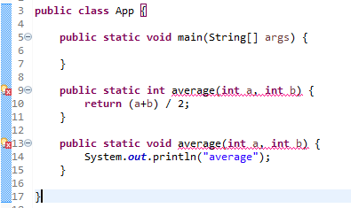

# Deep dive into JAVA methods


## Objectives
- Recap previous session
- Methods definition
- Homework exercises
- Guidelines

## Recap previous session
- What  is a variable?
- What is the type of the following value: `2.0`? What about `"2.0"`?
- What is the difference between a primitive type and a class?
- How do we call the input data passed to a method?
- What do you understand by a method?
- What do you understand by having a method that returns a value.
- If I declare a variable of type `int` and another variable of type `double`, can I store the value coresponding to the `double` variable into the `int` variable?
- How can I force, the storage of a double value into an int variable? What are the consequences?


## Methods

### How to create a method

- The template of creating a method is the following:
    `<ACCESS_MODIFIER> <STATIC/NON_STATIC> <RETURN_TYPE> <METHOD_NAME> (<PARAMETERS>)`
- Even though the template seems to be a bit scary, it will become very clear after a while. Now let's talk about each of these pieces:
    1. <`ACCESS_MODIFIERS`>
        - This refers to the visibility of the method but for now, we will always use `public`. Later on we will also see other possible values.
    2. <`STATIC/NON_STATIC`>
        - This specifies if the method needs or not (`static`) an instance of a class to be called.
        - Until next session when we will create our own object, we will only use `static` for all the methods that we are going to create
    3. <`RETURN_TYPE`>
        - This indicates what is the type of the value that will be returned.
        - If you remember, for example, the `length` method from the `String` class returned an integer number
        - If our method does not return anything, we should just use the keyword `void`
    4. <`METHOD_NAME`>
        - This is the name of the method. Or simply, how will this method be used later on
        - Same rules for naming a class also applies to the method with the mention that, by convention, names of the methods start with a lowercase

    5. <`PARAMETERS`>
        - This will be one or more parameters, namely the input that will be passed to the method
        - Note that a method can have 0 or more parameters
        - A parameters is declared similarly to how we define a variable: 
            - `int age`
            - `String name`
            - `double grade`
            - etc
- Now let's see some examples and try to map each portion of it to its respective template part:
    - `public static int length()`
        - <`ACCESS_MODIFIERS`>  -> here has the value `public`
        - <`STATIC/NON_STATIC`> -> here it is `static`
        - <`RETURN_TYPE`>       -> here it is `int`
        - <`PARAMETERS`>        -> this method does not have any parameter
    - `public static String substring(int beginIndex, int endIndex)`
        - <`ACCESS_MODIFIERS`>  -> here has the value `public`
        - <`STATIC/NON_STATIC`> -> here it is `static`
        - <`RETURN_TYPE`>       -> here it is `String`
        - <`PARAMETERS`>        -> This method has two parameters of type `int`
    - `public static void display()`
        - <`ACCESS_MODIFIERS`>  -> here has the value `public`
        - <`STATIC/NON_STATIC`> -> here it is `static`
        - <`RETURN_TYPE`>       -> here it is `void`, this means that the method will not return any value
        - <`PARAMETERS`>        -> this method does not have any parameter


- Now, let's see why do we need a method
    - For this, let's suppose the following thing, we want to display the average of three numbers, but we have to do this, say, for 5 times as in the program below:
    ```JAVA
        public class App {

            public static void main(String[] args) {
                double x = 10.0;
                double y = 11.22;
                double z = 23.44;
                double average = (x+y+z) / 3;
                System.out.println("The first average is: " + average);
                
                double x2 = 15.0;
                double y2 = 17.22;
                double z2 = 29.44;
                double average2 = (x2+y2+z2) / 3;
                System.out.println("The second average is: " + average2);
                
                double x3 = 120.0;
                double y3 = 155.22;
                double z3 = 237.44;
                double average3 = (x3+y3+z3) / 3;
                System.out.println("The third average is: " + average3);
                
            }
        }
    ```
    As you can see here, the logic which computes the average is duplicated in three place. We can easily say that is the same calculation performed, only the input changes.
    - Whenever we have situations like the one above, with duplicated code and similar functionality scattered all across the program, it is a sign that we need a method.
    - After refactoring, our code looks like:
        ```JAVA
        public class App {

            public static void main(String[] args) {
                
                double average = computeAverage(10.0, 11.22, 23.44);
                System.out.println("The first average is: " + average);
                

                double average2 = computeAverage(15.0, 17.22, 29.44);
                System.out.println("The second average is: " + average2);
                

                double average3 = computeAverage(120.0, 155.22, 237.44);
                System.out.println("The third average is: " + average3);
                
            }
            
            public static double computeAverage (double x, double y, double z) {
                double average = (x + y +z) / 3;
                return average;
            }
        }
        ```
    - Note: Refactoring means to improve how the code looks but not changing the functionality performed. In our case, the program still performed the average computation but we have improved the way it was structured

### Passing parameters to methods
- Just to recap, a method is a set of instruction that we use in order to perform a certain functionality
- Let's suppose we have the following methods which computes the `sum` of two integer numbers:
    ```JAVA
        public static void sum(){
            int a = 10;
            int b = 14;
            System.out.println(a+b);
        }
    ```
    - Our function is pretty easy to understand but not very helpfull. That's because, whenever we want to compute the sum of two integer numbers, we cannot reuse it, but instead recreate a method which looks very much like the one above. This will complicate our code for such small tasks
    - The solution is to have input parameters and thus, we can reuse the method for as many operation as we want:
    ```JAVA
        public static void sum(int a, int b) {
            System.out.println(a+b);
        }
    ```
- The parameters for a method are defined between the paranthesis that follow the method's name and are specified in the following format: `<type> <name>` and if there are multiple parameters, they are separated via a comma:
    - `int x, int y, int z` like in:
        ```JAVA
            public static void sum(int x, int y, int z) {
                System.out.println(x+y+z);
            }
        ```

### Returning a value from a method
- Let's think again to our method which computes the sum of certain integer numbers. As it is right now, we cannot reuse the result in another expression as the result is directly printed to the console
- For reusing the value later, we need our method to return a value. If you remember, we have already encountered methods that return a value, the `length` method from the `String` type, which returns the numbers of the characters inside a string:
    - ```JAVA
            String name = "Bogdan";
            int nameLength = name.length();
        ```
- The Syntax for a method which returns a value, is very simple, one has to replace the keyword `void` with the keyword that represents the type of the value that we wish to return. For example:
    - `public static int add(int x, int y)` => For a method that returns an int
    - `public static double pow(double x, int base)` => for a method that returns a double
    - `public static String getName()` => for a method that returns a String 
- NOTE: the type of the returned value should match the type specified in the definition of the method:
    - ```JAVA
        public static String getAnswer(){
            double answer = 45;
            return answer; //THIS METHOD WILL MAKE ECLIPSE TO SHOW AN ERROR! THE CODE WILL NOT COMPILE
        }
    ```
- When we talked about variables, you rememebr that we could not define the same variable twice, in the same class. The same thing holds for methods but it is a bit different:
    - We cannot have the exact method defined in the same scope
    - This means that we cannot have two methods with the same name and same parameters in the same scope. For example:
        ```JAVA
            	public static int average(int a, int b) {
                    return (a+b) / 2;
                }
                
                public static int average(int a, int b) {
                    return (a+b) / 2;
                }
        ```
        - This will make the JAVA compiler complain and give the following error message: `Duplicate method average(int, int) in type App`
        - In order to make this compile, we should do at least one of the following changes:
            - Change the name
            - Change the number of the parameters (by deleting one, or adding another one)
            - Change the type of the parameters (say from int to double)
- VERY IMPORTANT:
    - If you have two methods, with the same name, and same number and type of parameters but different name for the parameters, it will still complain as the compiler is analyzing the type and not the name of the parameters.
    - Also note that if your methods differ only by the return type (e.g `void` vs `int`), the compiler will still return an error as the return type is not of interest for the compiler.
    ```JAVA
        	public static int average(int a, int b) {
                return (a+b) / 2;
            }
            
            public static void average(int a, int b) {
                System.out.println("average");
            }
    ```
    

    - As you can see, even if the second method has a different return type, the compiler would still display an error
        

- To summarize the rules above, two methods are identical, from the point of view of the compiler if:
    - have the same name, same number of parameters, and same type of the parameters
NOTE: This is the first big concept that you have met so far, namely to have multiple methods, with the same name but different argument types/argument numbers. This is called: `method overloading`

### How to call a method
- Defining a method is the first step from the life of a method
- The next one is to use it. This procedure is named `calling a method` and it refers to use it in a certain place of code, with the condition that it has been previously defined.
- So far we have used this concept of `calling` a method each time we displayed something using the `print` or `println` method but let's see this concept with our own created method.
- Now let's suppose we want to have a method that computes the biggest number from 3 given double numbers. For this, until we will learn about conditional statements, we will use the method `Math.min()` which retrieves the minimumm from two numbers:
    ```JAVA
        public class App {

            public static void main(String[] args) {
                double minimum = min(3.0, 7.0, 9.0);
                System.out.println("The minimum between 3.0, 7.0, and 9.0 is: "+minimum);
            }
            
            public static double min(double x, double y, double z) {
                return Math.min(Math.min(x, y), z);
            }

        }
    ```
    - Here we have created the method which receives thre double parameters
    - Next we make use of the `Math.min` method which knows to compute the minimum of two numbers, not three, so we have to make a trick:
        - First compute the minimum between the first two, this will result in a single number, and then compute the min again from the remaining number and the previous result.
        - Again, how are we using the `Math.min` method it is also a method call.
        - Next, in our main function, we will make use of the previously defined method
        - when you call a method, you have to specify only the name and the values that will be passed as parameters
        - Note that you can also pass variables as parameters. see the example below:
        ```JAVA
        	public static void main(String[] args) {
                    double a = 3.0;
                    double b = 7.0;
                    double c = 9.0;
                    
                    double minimum = min(a,b,c);
                    System.out.println("The minimum between 3.0, 7.0, and 9.0 is: "+minimum);
                }
                
                public static double min(double x, double y, double z) {
                    return Math.min(Math.min(x, y), z);
                }
        ```
        Will display the same result as the snippet where we passed the values directly, without storing them in variables.

## Homework exercises
1. Create a method name `display` which does not have any parameters
2. Create a method name`sum`, which has two `int` parameters called `x` and `y`
3. Create a method, in the same java file with the method above, named `sum`, which has three `int` parameters called `x`, `y`, and `z`.
4. Create a method named `displayDouble` which receives a `double` parameter called `number` and displays its value doubled. 
5. Create a JAVA method named `average` which computes the average of three double numbers
6. Create a JAVA method named `average` which computes the average of three integer numbers
7. Create a JAVA method named `average` which computes the average of two integer numbers
8. For each of the methods that you have defined above, call them in the main method.

## Guidelines
- As always, try to type yourself all the code that you are seeing in this document
- Also look over the internet each of the subjects in the objectives and of course, any other topic that is not yet clear and then we will  analyze it again in the next session
- I suggest, if not for all, at least search over the internet for the following topic: `JAVA Method overloading`. I suggest visiting the following url: https://www.w3schools.com/java/java_methods_overloading.asp 