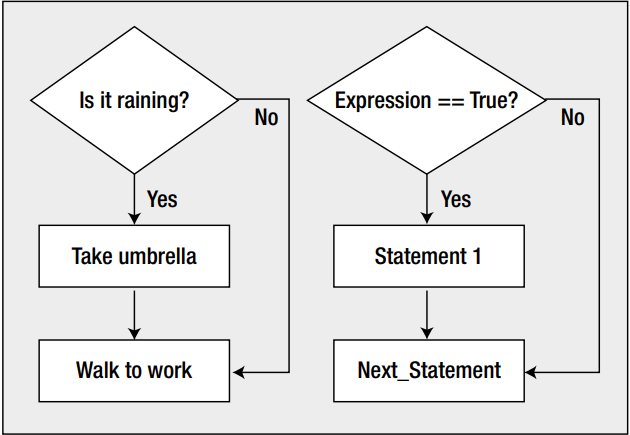

# JAVA Conditional Instructions

## Objectives
- Recap previous session
- Introduction to the `boolean` data type
- Boolean operators
- Making decisions
- Homework exercises
- Guidelines


## Recap previous session
- What do you understand by calling a method?
- What is a method parameter?
- Can we have two methods with the same name, same number and type of parameters but different type?
- Can we have two methods with the same name but different type and/or numbers of parameters?
- What is `method overloading`?
- Can you give some examples of method overloading from the String class? If not, keep it as an excercise.

## Introduction to the `boolean` data type
- For evaluating conditions, JAVA uses the so called ``boolean variables``
- The boolean type can only hold two values: `true` or `false`
- We can obtain a boolean variable when evaluating an expression to see if that is `true` or `false`.
- For example, if we want to check if an integer variable has the value 10 we do something like:
    ```JAVA
        int number = 9;
        boolean isTen = (number == 10);
    ```
    - One way to make a comparison is to use the double equal sign (`==`).
    - If you remember from our previous lessons, the way in which this expression gets evaluated is as follows:
        - first it checks if the number is equal or not with 10
        - After that, due to the fact that our number is 9 and not 10, the comparison will return the value `false`
        - The boolean variable `isTen` will store the value `false`

Note: Single equal sign means assignment, double equal sign means comparison

## Boolean operators
- Boolean operators are pretty much the same with logic operators from math, with slight modifications for some of them:
- `Greater than` operator:
    ```JAVA
        int a = 10;
        int b = 9;
        boolean result = a > b // true because 10 is greater than 9
    ```
- `Smaller than` operator:
    ```JAVA
        int a = 10;
        int b = 9;
        boolean result = a < b // false because 10 is not smaller than 9
    ```
- `Smaller or equal` operator:
    ```JAVA
        int a = 10;
        int b = 9;
        boolean result = b <= a // true because 9 is smaller than 10 thus satisfying the requirement of being smaller or equal.
    ```
- `Greater or equal` operator:
  ```JAVA
        int a = 10;
        int b = 9;
        boolean result = a >= b // true because 10 is greater than 9, thus satisfying the requirement of being greater or equal.
    ```
- `Equals to` operator:
    - We have already met this operator in the beginning of this section
        ```JAVA
            int a = 10;
            int b = 9;
            boolean result = a == b // false because 10 is not equal to 9
        ```
- `Not equals to` operator:
    ```JAVA
        int a = 10;
        int b = 9;
        boolean result = a != b // true because 10 is not equal to 9. We can also read it as "different than"
    ```
- `Logical or` operator:
    - it is denoted by two pipe symbols: `||`
    - It can be read as `OR`
    ```JAVA
        int a = 10;
        int b = 9;
        /*
        * It is true because even though a is not smaller than 5, the logical or operator requires at least one of the sides of it to evaluate to true
        */
        boolean result = a < 5 || b <= 9; 
    ```
    - Also not that logical or is a short circuit operator. This means that if the first side of it (the left handside) evaluates to true, it will not go to evaluate the right handside.
    - This is because, from its definition, the logical or needs at least one side of it to evaluate to true.

- `Logical and` operator: 
    - It is denoted by two and symbols `&&`
    - It can be simply read as `and`
    - The difference between this operator and the `or` operator is the fact that it requires both sides to evaluate to true
    - It is also a short circuit operator due to the fact that if the left handside evaluates to false, it will skip evaluating the right handside.
    ```JAVA
        int a = 10;
        int b = 9;
        /*
        * It is false because a is not smaller than 5 and even though the right handside evaluates to true, the logical and
        * requires bot sides to have expressions that evaluates to true.
        */
        boolean result = a < 5 && b <= 9; 
    ```
- Just to understand these two operators, take a look at the table below which summarizes when these operators evaluates to true or false:

    |  a       |  b     | `a && b`   | `a || b`   |  
    | :----:   | :----: | :--------: | :--------: |
    |  true    | true   | true       | true       |
    |  true    | false  | false      | true       |
    |  false   | true   | false      | true       |
    |  false   | false  | false      | false      |

- If it is harder for you to understand this table, don't worry, we will have it explained in the class and also, we can come back to it as many times as we need

## Making decisions
- The ability of comparing values of expressions is one of the most important features of a programming language.
- By `decision making` we mean the ability of choosing to execute one set of program statements rather than another, based on the date.
- This is pretty similar with the decisions that we take in the real life:
    ```JAVA
        if it is raining outside
            then take an umbrella
        else
            just wear a T-Shirt and sunglasses
    ```
- In JAVA, decisions are made using the `if`, `else`, `else-if` keywords. We will analyse them one by one and you will see how simply it is to use them.

### The basic `if` statement
- In JAVA, one of the simplest statements for making decisions is the `if` statement
- The snippet below compares your height with someone else and prints a different sentence depending on the results:
    ```JAVA
        public class App {

            public static void main(String[] args) {
                
                int bogdanHeight = 172;
                int marianHeight = 177;
                
                if (bogdanHeight > marianHeight) {
                    System.out.println("Bogdan is Taller");
                }
                
                if(marianHeight > bogdanHeight) {
                    System.out.println("Marian is Taller");
                }

                if(marianHeight == bogdanHeight) {
                    System.out.println("These children have the same height");
                }
                
            }
            
        }
    ```
    - There are three `if` statements here
    - The boolean expression for the comparison in each case, appears between the parantheses that immediately follow the keyword `if`
    - If the  result of a comparison is `true`, the statement immediately after the `if` will be executed
    - If the result of a comparison is `false`, the statement following the `if` will be skipped
- In the image below, we can see the process of making decisions, illustrated wirth a diagram:
 

- Now let's make an exercise in which we ask the user to enter a number between 1 and 10 and the output will tell how that number relates to 5 or 6, meaning that if the number is greater than 5, we will display the number and a statement that says it is bigger than 5. But if the number is smaller than 6, we show the number together with a statement that says that the number is smaller than 6.:
    ```JAVA
        import java.util.Scanner;

        public class App {

            public static void main(String[] args) {
                Scanner in = new Scanner(System.in);
                System.out.println("Enter an integer number between 1 and 10:");
                int number = in.nextInt();
                if(number > 5) {
                    System.out.println("You entered " + number + " which is greater than 5");
                }
                
                if(number < 6) {
                    System.out.println("You entered " + number + " which is smaller than 6");
                }
            }
            
        }
    ```

## Homework exercises
1. Create a JAVA program which evaluates the following expressions:
    - 10 > 4
    - 123 >= 123
    - 23 < 22 || 21 != 20
    - 23 < 22 && 21 != 20
    - 10 != 10
    - 10 == 10
    - Note: before running the program, try to think what will be the result. Also, for a better visualisation of the results, try to assign each number from the expression to variables and also store the result in a boolean variable. In the end, simply call `System.out.println` and pass the result as parameter.

## Guidelines
- Even though, most of the time, the precedence of the operator matches the one from Math, we should always make a habbit of using paranthesis to avoid subtle bugs.