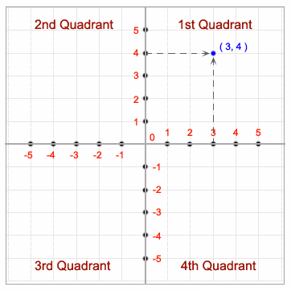

# JAVA Conditional Instructions

## Objectives
- Recap previous session
- Introduction to reading from the standard input
- Introduction to the `boolean` data type
- Boolean operators
- Making decisions
- Homework exercises
- Guidelines


## Recap previous session
- What do you understand by calling a method?
- What is a method parameter?
- Can we have two methods with the same name, same number and type of parameters but different type?
- Can we have two methods with the same name but different type and/or numbers of parameters?
- What is `method overloading`?
- Can you give some examples of method overloading from the String class? If not, keep it as an excercise.

## Introduction to reading from the standard input
- By standard input, we mean the terminal. And reading from the standard input, simply means that we want to be able to introduce values in the terminal such that the program will be able to use them.
- Before explaining, let's see how this can be done and then we will explain everything line by line:
    ```JAVA
        import java.util.Scanner;

        public class App {

            public static void main(String[] args) {
                Scanner in = new Scanner(System.in);
                
                System.out.println("Enter an integer number:");
                int number = in.nextInt();
                System.out.println("The integer number entered is: " +  number);
                
                System.out.println("Enter a double number:");
                double number2 = in.nextDouble();
                System.out.println("The double number entered is: " + number2);
                
                System.out.println("Enter a word:");
                String word = in.next();
                System.out.println("The word entered is: " + word);
            
            }
            
        }

    ```
    - The first line which is very new to you is this: `import java.util.Scanner;`
        - We need this because the functionality that enables us to read from the standard input, resides in a different package, namely the `java.util` package
        - Now if you recall, a package is simply a way to structure you code and classes and JAVA creators decided to put classes with similar functionality in the same package. This means that there are a lot of packages in the JAVA framework but no worry about it, you will see that our IDE can take care of it by itself
        - Now you might wonder, `well, String is also a class and we haven't used any import for it. Also for the Math class`. The answer is that we have a package, called `java.lang` package which contains the classes that most of the JAVA application will use and that's why, it is imported by default.
    - The next interesting line is the one in which we declare a variable of type Scanner and then we initialize it with the keyword `new: `` Scanner in = new Scanner(System.in);``
        - Also this way of initializing is fresh for you but it will become a habbit in the next sessions when we will learn about creating our own classes and will also learn about constructors. Until then, just try to use this line exactly as it is whenever you need to read data from the standard input.
    - Now that we have a variable of type `Scanner`, which we can also call it an object, all that we have to do, is to call the method specific to the data type that I want to read from the terminal.
    - For example, if I want to read an integer number, I have to call the `in.nextInt()` method which will read an `int` number and it will return to the caller.
    - You can see in the example, how can we read numbers and text from the standard input, a.k.a terminal.
    - This is pretty much everything that you should know in order to be able to follow the examples and exercises from this session.
## Introduction to the `boolean` data type
- For evaluating conditions, JAVA uses the so called ``boolean variables``
- The boolean type can only hold two values: `true` or `false`
- We can obtain a boolean variable when evaluating an expression to see if that is `true` or `false`.
- For example, if we want to check if an integer variable has the value 10 we do something like:
    ```JAVA
        int number = 9;
        boolean isTen = (number == 10);
    ```
    - One way to make a comparison is to use the double equal sign (`==`).
    - If you remember from our previous lessons, the way in which this expression gets evaluated is as follows:
        - first it checks if the number is equal or not with 10
        - After that, due to the fact that our number is 9 and not 10, the comparison will return the value `false`
        - The boolean variable `isTen` will store the value `false`

Note: Single equal sign means assignment, double equal sign means comparison

## Boolean operators
- Boolean operators are pretty much the same with logic operators from math, with slight modifications for some of them:
- `Greater than` operator:
    ```JAVA
        int a = 10;
        int b = 9;
        boolean result = a > b // true because 10 is greater than 9
    ```
- `Smaller than` operator:
    ```JAVA
        int a = 10;
        int b = 9;
        boolean result = a < b // false because 10 is not smaller than 9
    ```
- `Smaller or equal` operator:
    ```JAVA
        int a = 10;
        int b = 9;
        boolean result = b <= a // true because 9 is smaller than 10 thus satisfying the requirement of being smaller or equal.
    ```
- `Greater or equal` operator:
  ```JAVA
        int a = 10;
        int b = 9;
        boolean result = a >= b // true because 10 is greater than 9, thus satisfying the requirement of being greater or equal.
    ```
- `Equals to` operator:
    - We have already met this operator in the beginning of this section
        ```JAVA
            int a = 10;
            int b = 9;
            boolean result = a == b // false because 10 is not equal to 9
        ```
- `Not equals to` operator:
    ```JAVA
        int a = 10;
        int b = 9;
        boolean result = a != b // true because 10 is not equal to 9. We can also read it as "different than"
    ```
- `Logical or` operator:
    - it is denoted by two pipe symbols: `||`
    - It can be read as `OR`
    ```JAVA
        int a = 10;
        int b = 9;
        /*
        * It is true because even though a is not smaller than 5, the logical or operator requires at least one of the sides of it to evaluate to true
        */
        boolean result = a < 5 || b <= 9; 
    ```
    - Also not that logical or is a short circuit operator. This means that if the first side of it (the left handside) evaluates to true, it will not go to evaluate the right handside.
    - This is because, from its definition, the logical or needs at least one side of it to evaluate to true.

- `Logical and` operator: 
    - It is denoted by two and symbols `&&`
    - It can be simply read as `and`
    - The difference between this operator and the `or` operator is the fact that it requires both sides to evaluate to true
    - It is also a short circuit operator due to the fact that if the left handside evaluates to false, it will skip evaluating the right handside.
    ```JAVA
        int a = 10;
        int b = 9;
        /*
        * It is false because a is not smaller than 5 and even though the right handside evaluates to true, the logical and
        * requires bot sides to have expressions that evaluates to true.
        */
        boolean result = a < 5 && b <= 9; 
    ```
- Just to understand these two operators, take a look at the table below which summarizes when these operators evaluates to true or false:

    |  a       |  b     | `a && b`   | `a || b`   |  
    | :----:   | :----: | :--------: | :--------: |
    |  true    | true   | true       | true       |
    |  true    | false  | false      | true       |
    |  false   | true   | false      | true       |
    |  false   | false  | false      | false      |

- If it is harder for you to understand this table, don't worry, we will have it explained in the class and also, we can come back to it as many times as we need

## Making decisions
- The ability of comparing values of expressions is one of the most important features of a programming language.
- By `decision making` we mean the ability of choosing to execute one set of program statements rather than another, based on the date.
- This is pretty similar with the decisions that we take in the real life:
    ```JAVA
        if it is raining outside
            then take an umbrella
        else
            just wear a T-Shirt and sunglasses
    ```
- In JAVA, decisions are made using the `if`, `else`, `else-if` keywords. We will analyse them one by one and you will see how simply it is to use them.

### The basic `if` statement
- In JAVA, one of the simplest statements for making decisions is the `if` statement
- The snippet below compares your height with someone else and prints a different sentence depending on the results:
    ```JAVA
        public class App {

            public static void main(String[] args) {
                
                int bogdanHeight = 172;
                int marianHeight = 177;
                
                if (bogdanHeight > marianHeight) {
                    System.out.println("Bogdan is Taller");
                }
                
                if(marianHeight > bogdanHeight) {
                    System.out.println("Marian is Taller");
                }

                if(marianHeight == bogdanHeight) {
                    System.out.println("These children have the same height");
                }
                
            }
            
        }
    ```
    - There are three `if` statements here
    - The boolean expression for the comparison in each case, appears between the parantheses that immediately follow the keyword `if`
    - If the  result of a comparison is `true`, the statement immediately after the `if` will be executed
    - If the result of a comparison is `false`, the statement following the `if` will be skipped
- In the image below, we can see the process of making decisions, illustrated wirth a diagram:
 
- One use of the `if` statement that we can think ok, is for example in a banking application. Think that when the user wants to withdraw money, we can simply check if the amount that it wants to withdraw is smaller or equal to what he/she has available in the account, thus, the `if` statement allows us to limit the input that we accept.

- As you might have already seen, the syntax of an if statement looks like this:
    ```JAVA
        if (condition) {
            //statement is executed
        }
    ```

#### Class Exercises = if statement

1. Create a JAVA program which asks the user to enter a number between 1 and 10 and then output how will the entered number relate to 5 or 6.
    - Sample Input: 5
    - Sample Output: You entered 5 which is smaller than 6
    - Solution:
    ```JAVA
        import java.util.Scanner;

        public class App {

            public static void main(String[] args) {
                Scanner in = new Scanner(System.in);
                System.out.println("Enter an integer number between 1 and 10:");
                int number = in.nextInt();
                if(number > 5) {
                    System.out.println("You entered " + number + " which is greater than 5");
                }
                
                if(number < 6) {
                    System.out.println("You entered " + number + " which is smaller than 6");
                }
            }
            
        }
    ```


### Extending the `if` statement: `if-else`
- If we take a look at our previous example in which we compare the heights of two children, we can be sure that one child cannot be in the same time smaller and taller, thus, we can simplify the example to:
    ```JAVA
        public class App {

            public static void main(String[] args) {
                
                int bogdanHeight = 172;
                int marianHeight = 177;
                
                if (bogdanHeight > marianHeight) {
                    System.out.println("Bogdan is Taller");
                } else if(marianHeight > bogdanHeight) {
                    System.out.println("Marian is Taller");
                } else {
                    System.out.println("These children have the same height");
                }
                
            }
            
        }
    ```
    - Now let's see what is happening here. First we check if the height of bogdan is smaller or higher than the height of marian, if it is not, we go over to the next if statement which JAVA has a certain syntax for it, namely `else if`
    - The else if is like a continuation of the first if in case that did not passed the check. If also this check failed (returned false), we have the last step which is simple an `else` statement. We don't have another `if` here because one value can be higher, smaler or equal than another value, that's why, our last else is like a catch all statement.
- The idea behind having multiple `if` and `else if` statements is to emphasize a list of steps that should be performed in certain situations which cannot occur in the same time.
- Also there is no need to have an `else-if`, we can have only an `if` or `else-if`, it simply depends on the logic that we want to implement

NOTE: What you should remember is the following:
    - The first statement should always be the `if` statement
    - The second or any other following can be an `else-if` statement
    - The last one, most of the time, should be an  `else` statement. I say most of the time, because in some situations, the compiler will force you to have an `else` statement but in others do not. Nevertheless, omitting to put the else statement can lead to `bugs`.

- As you might have already seen, the syntax of an `if-else` statement looks like this:
    ```JAVA
        if (condition) {
            //statement is executed
        } else {
            //other statement is executed.
        }
    ```

#### Class exercises - IF-Else statements
1. Create a JAVA program which will solve quadratic equations by reading the values of the equations from the Standard Input:
    - Sample Input:
    - Sample Output:
    - Solution:
        ```JAVA
            import java.util.Scanner;

            public class App {

                public static void main(String[] args) {
                    Scanner in = new Scanner(System.in);
                    
                    System.out.print("Enter value for a: ");
                    double a = in.nextDouble();
                    

                    System.out.print("Enter value for b: ");
                    double b = in.nextDouble();
                    
                    System.out.print("Enter value for c: ");
                    double c = in.nextDouble(); 
                    
                    double result = b*b - 4.0 * a * c;
                    if(result > 0.0) {
                        double r1 = (-b + Math.sqrt(b * b - 4 * a * c))/2 * a;
                        double r2 = (-b - Math.sqrt(b * b - 4 * a * c))/2 * a;
                        System.out.println("The roots are "+r1+ " and " + r2);
                    } else if(result == 0.0) {
                        double r1 = -b / (2.0 * a);
                        System.out.println("We only have one root: " + r1);
                    } else {
                        System.out.println("The equation has no real roots");
                    }
                
                }
                
            }
        ```
2. Create a JAVA method, called `isEven` which accepts one integer number and checks if the number is even or not. If the number is even, it should return `true`, otherwise `false`
    - Sample Input: 4
    - Sample Output: true
    - Solution:
    ```JAVA
        import java.util.Scanner;

        public class Application {

            public static void main(String[] args) {
                Scanner in = new Scanner(System.in);
                System.out.print("Enter a value for x: ");
                int x = in.nextInt();
                System.out.println(isEven(x));
            }
            
            public static boolean isEven(int number) {
                if(number % 2 == 0) {
                    return true;
                } else {
                    return false;
                }
            }
        }

    ```
3. Create a JAVA program that determines a student's grade. The program will read three types of scores: quizz, mid-term and final-scores. Then, it will determine the grade based on the following rules:
    - if the average score >=90% then the grade is A
    - if the average score >= 70% and  < 90% then the grade is B
    - if the average score >=50% and <70% then the grade is C
    - if the average score <50% then the grade is F
    - Sample Input:
        - Enter QUIZ score: 80
        - Enter Mid-Term score:68
        - Enter Final Score: 90
    - Sample Output:
        - Your grade is B.
    - Solution: 
        ```JAVA
            import java.util.Scanner;

            public class Application {

                public static void main(String[] args) {
                    Scanner in = new Scanner(System.in);
                    System.out.print("Enter QUIZ score: ");
                    double quizScore = in.nextDouble();
                    System.out.print("Enter Mid-Term score: ");
                    double midTermScore = in.nextDouble();
                    System.out.print("Enter Final score: ");
                    double finalScore = in.nextDouble();
                    
                    double average = computeAverage(quizScore, midTermScore, finalScore);
                    
                    if(average >= 90.0) {
                        System.out.println("You grade is A");
                    } else if (average >= 70.0 ||average < 90.0) {
                        System.out.println("Your grade is B");
                    } else if (average >= 50 || average < 70) {
                        System.out.println("Your grade is C");
                    } else {
                        System.out.println("Your grade is F");
                    }
                }

                private static double computeAverage(double quizScore, double midTermScore, double finalScore) {
                    return (quizScore + midTermScore + finalScore ) / 3;
                }
                
            }
        ```
4. Write a JAVA program which will read the day number starting with 1 for Monday and 7 for Sunday, and it will return the name of the day.
    - Sample input: 
        - Enter the number of the day: 2
    - Sample output: Tuesday
    - Solution: 
        ```JAVA
            import java.util.Scanner;

            public class Application {

                public static void main(String[] args) {
                    Scanner in = new Scanner(System.in);
                    System.out.print("Enter the number of the day: ");
                    int day = in.nextInt();
                    if(day == 1) {
                        System.out.println("Monday");
                    } else if (day == 2) {
                        System.out.println("Tuesday");
                    } else if (day == 3) {
                        System.out.println("Wednesday");
                    } else if (day == 4) {
                        System.out.println("Thursday");
                    } else if (day == 5) {
                        System.out.println("Friday");
                    } else if (day == 6) {
                        System.out.println("Saturday");	
                    } else {
                        System.out.println("Sunday");
                    }
                }
            }

        ```
### Nested `if-else`
- By nested we mean that we can have nested `if` statements inside other `if` statements like in the snippet below:
    ```JAVA
        if(condition1) {
            if(subcondition) {
                then statement
            } else {
                then statement
            }
        } else if (condition2) {
            if(subcondition) {
                then statement
            } else {
                then statement
            }
        }
        //etc
    ```
- Note that in the snippet above we don't have valid JAVA code from the syntax perspective.
    - This is something which is usually called Pseudocod
    - It is useful just for explaining a concept and not for compiling it and turning it into a real life program.
- Also note that you can have as many nested `if` statements as you want but do not overuse them. You will see that when you have more than 2 levels of nestedness, your code will become harder to read.

#### Class exercises -NESTED IF-Else statements
1. Write a JAVA program which reads  a year from the keyboard and then determines if the year is leap or not.
    - Sample input:
        - Enter the year: 1992
    - Sample output: 1992 is a leap year
    - Sample input: 
        - Enter the year: 2015
    - Sample output: 2015 is not a leap year
    - Solution:
        ```JAVA
        import java.util.Scanner;

        public class Application {

            public static void main(String[] args) {
                Scanner in = new Scanner(System.in);
                System.out.print("Enter a year : ");
                int year = in.nextInt();
                if (year % 4 == 0)
                {
                    if (year % 100 == 0)
                    {
                        if (year % 400 == 0)
                        {
                        System.out.println(year + "is a leap year");
                        }
                        else
                        {
                        System.out.println(year + "is not a leap year");
                        }
                    }
                    else
                    {
                        System.out.println(year+ " is a leap year");
                    }
                }
                else
                {
                    System.out.println(year + "is not a leap year");
                }
            }
        }
        ```
## Homework exercises
1. Create a JAVA program which evaluates the following expressions:
    - 10 > 4
    - 123 >= 123
    - 23 < 22 || 21 != 20
    - 23 < 22 && 21 != 20
    - 10 != 10
    - 10 == 10
    - Note: before running the program, try to think what will be the result. Also, for a better visualisation of the results, try to assign each number from the expression to variables and also store the result in a boolean variable. In the end, simply call `System.out.println` and pass the result as parameter.
2. Write a JAVA program which reads a number from the Standard Input and then prints whether it is negative or positive
    - Sample Input: 35
    - Sample Output: The number 35 is positive
3. Write a JAVA program which allows the user to input her/his age. Then the program will show if the person is eligible to vote. Aperson who is eligible to vote must be older than or equal to 18 years old
    - Sample input: 17
    - Samle output: This person is not eligible for voting
4. Write a JAVA program to accept a coordinate point in a XY coordinate system and determine inw hich quadrant the coordinate point lies.
    - Sample input:
        - Enter X: 3
        - Enter Y: 4
    - Sample output: The Point P(3,4) lies in the first quadrant
    - Sample input:
        - Enter X: -3
        - Enter Y: -3
    - Sample Output: The Point P(-3,-3) lies in the third quadrant
NOTE: take a look at the image below in order to clearly see where a certain point resides
    
5. Write a JAVA program which check if three sides form a triangle or not.
    - Sample Input:
        - a: 7
        - b: 10
        - c: 5
    - Sample output: The entered numbers can form a valid triangle
    - Sample Input:
        - a: 1
        - b: 10
        - c: 12
    - Sample output: The entered numbers cannot form a valid triangle
## Guidelines
- Even though, most of the time, the precedence of the operator matches the one from Math, we should always make a habbit of using paranthesis to avoid subtle bugs.